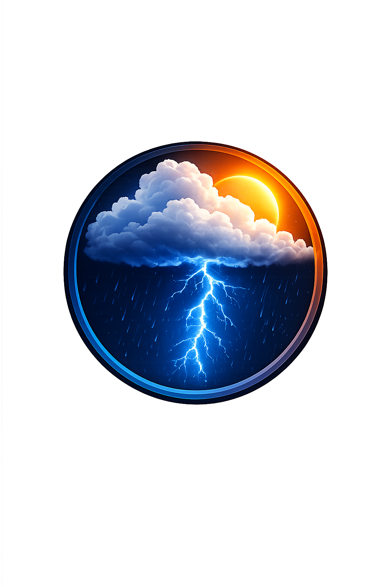
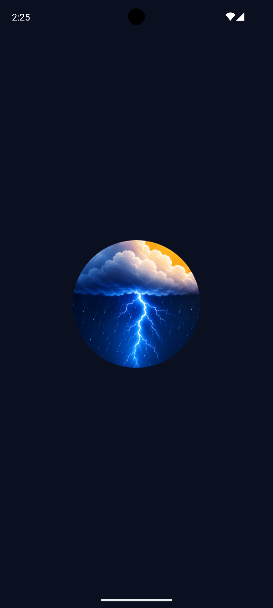
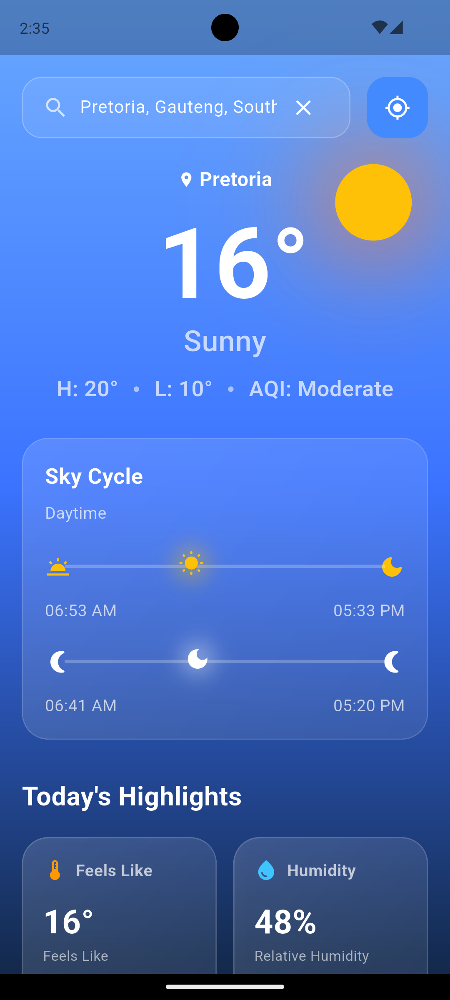
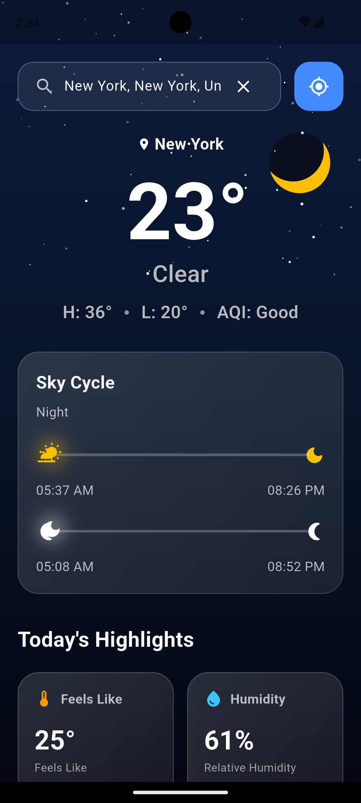
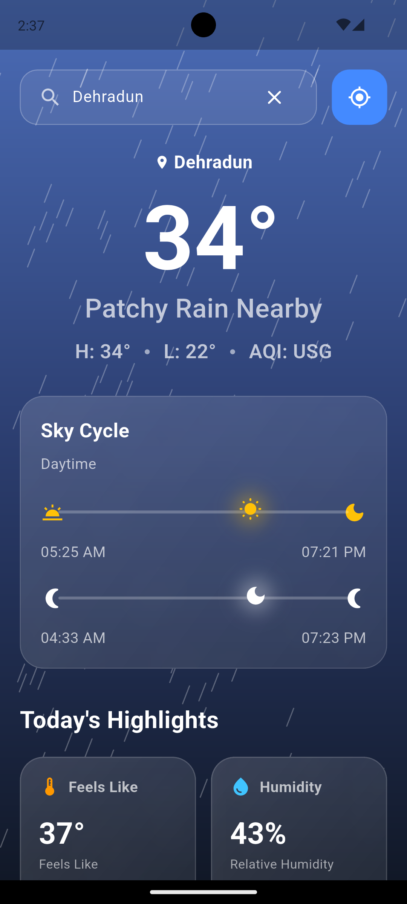
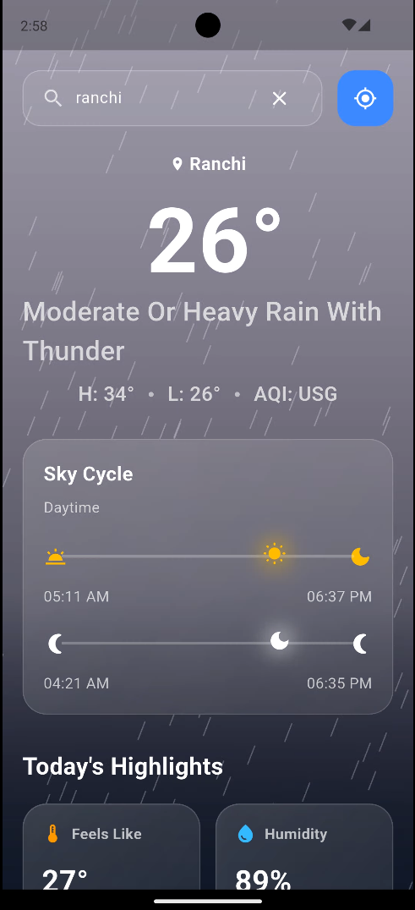
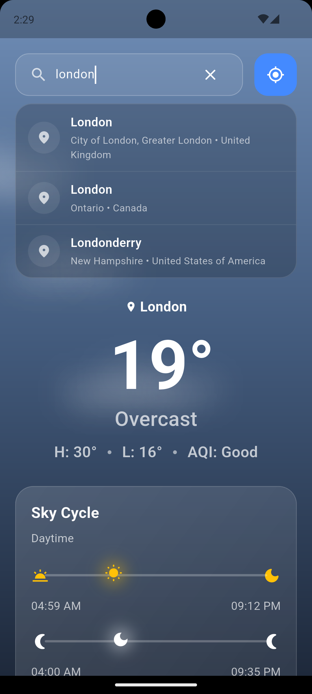
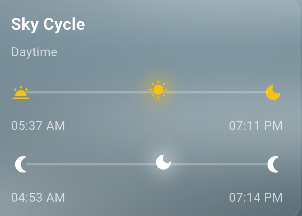
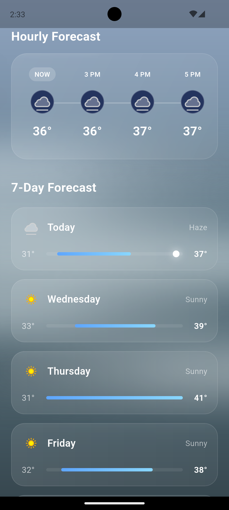

<div align="center">



# Tempest

### Know the Sky

A modern Flutter weather application featuring real-time forecasts, animated weather scenes, dynamic day & night themes, AQI, and an elegant glassmorphism interface.

<br>


</div>

---

# ✨ Features

- 🌤 Real-time Weather
- 📅 7-Day Forecast
- 🕒 24-Hour Forecast
- 🌍 Search Any City
- 📍 GPS Location Detection
- 🌅 Sunrise & Sunset Timeline
- 🌙 Moonrise & Moonset Timeline
- 🌡 Air Quality Index (AQI)
- 🎨 Dynamic Backgrounds
- 🌧 Animated Weather Scenes
- ☀ Dynamic Day & Night Theme
- ❄ Rain, Snow, Mist & Thunder Effects
- 🔍 Smart City Suggestions
- ✨ Glassmorphism UI
- 🚀 Native + Animated Splash Screen

---

# 📱 Screenshots

|                                  Splash Screen                                  |                                 Sunny Weather                                  |
|:-------------------------------------------------------------------------------:|:------------------------------------------------------------------------------:|
|  |  |

|                                 Night Weather                                  |                                 Rain                                 |
|:------------------------------------------------------------------------------:|:--------------------------------------------------------------------:|
|  |  |

|                                  Thunderstorm                                   |                                  Search                                  |
|:-------------------------------------------------------------------------------:|:------------------------------------------------------------------------:|
|  |  |

|                                Sky Cycle                                |                                  Forecast                                   |
|:-----------------------------------------------------------------------:|:---------------------------------------------------------------------------:|
|  |  |
---

# 🛠 Tech Stack

| Technology     | Usage                |
|----------------|----------------------|
| Flutter        | UI Framework         |
| Dart           | Programming Language |
| Provider       | State Management     |
| WeatherAPI     | Weather Data         |
| Geolocator     | Current Location     |
| HTTP           | REST API             |
| Flutter Dotenv | API Key Security     |

---

# 📂 Project Structure

```text
lib
│
├── models
├── providers
├── services
├── screens
├── widgets
│     ├── background
│     └── cards
├── utils
└── main.dart
```

---

# 🚀 Getting Started

Clone the repository

```bash
git clone https://github.com/jays1310/tempest.git
```

Install dependencies

```bash
flutter pub get
```

Create a `.env` file

```env
WEATHER_API_KEY=YOUR_API_KEY
```

Run the application

```bash
flutter run
```

---

# 📦 Packages Used

- provider
- http
- intl
- geolocator
- geocoding
- flutter_dotenv
- flutter_launcher_icons
- flutter_native_splash

---

# 🔮 Future Improvements

- Weather Alerts
- Home Screen Widgets
- Favorite Cities
- Offline Caching
- Weather Maps
- Material You Support
- iOS Version

---

# 👨‍💻 Developer

**Jay Sheth**

Mobile Application Developer

GitHub

https://github.com/jays1310

LinkedIn

https://www.linkedin.com/in/jay-sheth-515579284/

---

# ⭐ Support

If you like this project, consider giving it a ⭐ on GitHub.